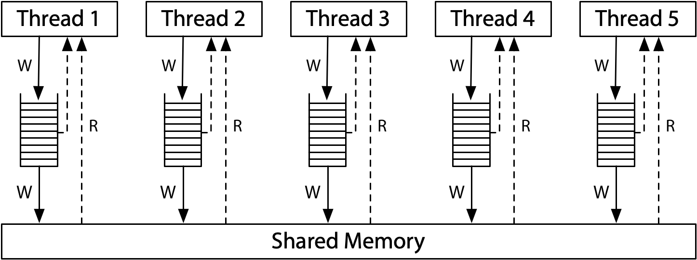
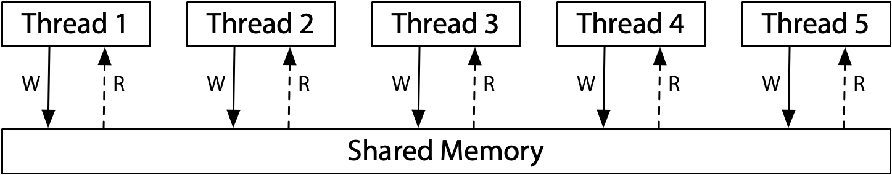
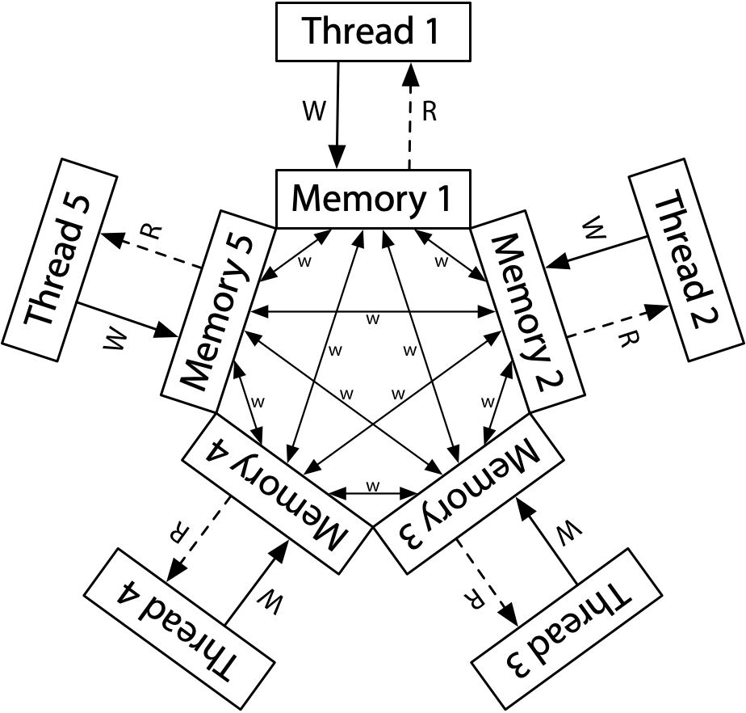

# [Hardware Memory Models](https://research.swtch.com/hwmm)

The x86, after a long [history](https://web.archive.org/web/20091124045026/http://9fans.net/archive/1997/04/76) of [struggle](https://lkml.org/lkml/1999/11/20/76) between the hardware architects and software (especially OS kernel) developers, both [Intel](http://www.cs.cmu.edu/~410-f10/doc/Intel_Reordering_318147.pdf) and [AMD](https://courses.cs.washington.edu/courses/cse351/12wi/supp-docs/AMD%20Vol%201.pdf) finally settled down on what's later known as **the x86 TSO (total store ordering) model**, which is a rather strong memory model much close to the rather friendly (towards software developers) sequential consistent model defined by [Leslie Lamport](https://www.microsoft.com/en-us/research/publication/make-multiprocessor-computer-correctly-executes-multiprocess-programs), i.e. a concurrent execution is equivalent to a single thread of execution composed of interleavings of each involved threads with which all threads find their program order consistent. Mental model is like this : all stores are buffered by some FIFO queue before committed to the main memory, and all reads are as if happening directly on the main memory, except each thread may also check its local store buffer. This is why it's named as _total store order_: all the (hardware) threads agree on the ordering of all the writes that happen to the [shared memory](https://preshing.com/20120913/acquire-and-release-semantics/#IDComment1062736740): again, the reads are as if happening directly on the main memory!

Ok maybe we first need to examine the mental model for sequential consistent as proposed by Lamport . Well it's just TSO sans the write buffer: all writes happen in some serialized order and all reads by all threads, since they are as if observing the main memory directly, agrees on that order.

OTOH we know that Power and ARM boasts a (similar) weaker memory model, which is largely similar to depicted by [Jeff Preshing](https://preshing.com/20120710/memory-barriers-are-like-source-control-operations), i.e. a (rather confusing) source control system, store operations appear to be in arbitrary order from other hardware threads' PoV, and there are hardware reordering to program order (load buffering) .

``` c
//! Litmus Test: Load Buffering
//! Is it possible that the hardware thread local variables (registers) be the following config:
//! `(r1 = 1 && r2 = 1)`
//! (Can each thread’s read happen after the other thread’s write?)

static int32_t x = 0, y = 0;
void thrd_0(void) {
    int32_t r1 = x;
    y          = 1;
}
void thrd_1(void) {
    int32_t r2 = y;
    x          = 1;
}

// `SeqCst`  => impossible
// TSO       => impoisslbe
// ARM/Power => possible!
```

In particular, here's another litmus test that would pass on `SeqCst` machines, x86 TSO machines but ARM/Power machines. Note that for x86, due to TSO, for inter-thread communication, we may deem each store as a _store-release_ and each load a _load-acquire_.

``` c
//! Litmus test: IRIW (independent reads of independent writes)
//! Can this happen?
//! `(r0 == 0 && r1 == 1 && r2 == 1 && r3 == 0)`
//! i.e. can readers other than the writer themselves disagree on what happened before what?

static int32_t x = 0, y = 0;
void thrd_x(void) {
    x = 1;
}
void thrd_y(void) {
    y = 1;
}
void thrd_0(void) {
    int32_t r0 = x;
    int32_t r1 = y;
}
void thrd_1(void) {
    int32_t r2 = y;
    int32_t r3 = x;
}

// `SeqCst`  => impossible
// TSO       => impossible
// ARM/Power => possible!!
```

Though weak, ARM/Power respects [**coherence**](https://sabrinajewson.org/rust-nomicon/atomics/relaxed.html): each hardware thread agrees on **modification order** of atomic variables.

``` c
//! Litmus test: coherence
//! Can this program end up with this?
//! `(r0 == 1 && r1 == 2 && r2 == 2 && r3 == 1)`
//! (Can threads disagree on modification order of a single memory location?)

static int32_t x = 0;
void thrd_0(void) {
    x = 1;
}
void thrd_1(void) {
    x = 2;
}
void thrd_2(void) {
    int32_t r0 = x;
    int32_t r1 = x;
}
void thrd_3(void) {
    int32_t r2 = x;
    int32_t r3 = x;
}

// `SeqCst`  => impossible
// TSO       => impossible
// ARM/Power => impossible
```

Still, there's lots of crannies and nooks that only hardware architects, compiler, and OS kernel developers understand. A worth mention is [late ARMv8 adapts a stricter memory model, _multicopy-atomic_, ensuring writes become visible to all other threads at once](https://www.cl.cam.ac.uk/~pes20/armv8-mca/armv8-mca-draft.pdf), due to practically speaking the chips always performs as such and it seems not quite feasible for ARM chips to milk any performance gains from that. OTOH IBM Power *does* allow for _non-multicopy-atomic_ behaviors, i.e. writes maybe become visible to only a proper subset of threads before they are visible to all the hardware threads. In this regard the Power architecture is one hell of an instantiation as described by [Jeff Preshing's source control analogy](https://preshing.com/20120710/memory-barriers-are-like-source-control-operations).

Fortunately Adve and Hill [Weak Ordering - A New Definition](https://rsim.cs.uiuc.edu/Pubs/ps2pdf/isca90.pdf) provides some nice definitions/abstractions.

> A contract between software and hardware

A **synchronization model** is a _set of constraints on memory access that specify how and when synchronization needs to be done_.

The **DRF (data-race-free)** model assumes hardware to provide certain memory synchronization operations separate from ordinary memory reads and writes; ordinary memory reads and writes may be reordered between synchronization operations, but not moved across them (i.e. they also serve as barriers to reordering).

A program is said to be _data-race-free_ if _**for all idealized sequentially consistent executions**, any two ordinary memory access to the **same location** from different threads are either **both reads** or else **separated by synchronization operations forcing one to happen before the other**_.

A hardware is **weakly ordered** with respect to a synchronization model iff it appears sequentially consistent to **all software** that obey the synchronization model.

Finally they provided some proofs for ensuring when hardware is **weakly ordered by DRF**, characterizing the sort of hardware that executes _data-race-free_ programs as if by a sequentially consistent ordering, which is still much relevant today: all modern x86, ARM, and Power chips are **DRF-SC**.

It's one of the major [backbones](https://www.cs.toronto.edu/~pekhimenko/courses/csc2231-f17/Papers/C++Consistency.pdf) towards the C++11/C11 memory model.

Note that the term _data-race_ as in _data-race-free_ is somewhat different from that used in modern Rust [context](https://sabrinajewson.org/rust-nomicon/atomics/relaxed.html): a Rust `AtomicI32` is subject to _data-race_ as formalized by Adve and Hill, but in Rust terms, atomic types are guaranteed not to suffer data race (i.e. broken intermediate value), while _race conditions_ might well be the case if all we have are `Relaxed` orderings. So the term _data-race_ in Adve and Hill is more or less generalized version of the Rust term _race conditions_, while in Rust the term _data race_ refers to specifically torn values.